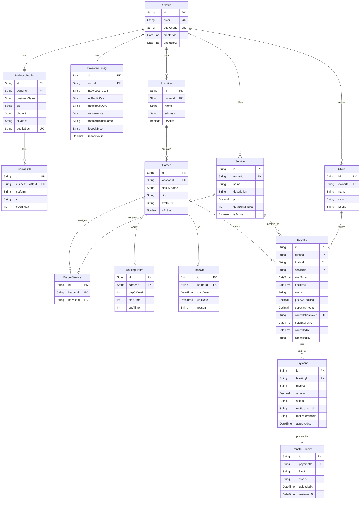

# Data Model Documentation
## Reserva Barber

> **Stack:** PostgreSQL (Supabase) + Prisma ORM. Field types below use Prisma/PostgreSQL
> conventions (`String`, `Int`, `DateTime`, `Decimal`, `Boolean`, plus native `enum`s).
> Files (profile/cover images, transfer receipts) are stored in **Supabase Storage**;
> the database persists only their URL/path.

---

## Document Purpose

This document describes the data model for the **Reserva Barber** application, including:
- Entity descriptions and field definitions
- Validation rules per entity
- Relationships between entities
- An entity-relationship (ER) diagram

**Identifier convention:** every entity uses a surrogate string primary key `id`
(`@id @default(cuid())`). This keeps public-facing identifiers (e.g., in URLs and the
cancellation link) non-sequential and non-guessable.

**Money convention:** all monetary values use `Decimal` (never floating point), in ARS.

---

## Model Descriptions

### 1. Owner
The single administrative user of the system — the business owner who manages every location, barber, service, and payment setting. There is no barber login and no multi-owner tenancy in this version. Authentication is handled by **Supabase Auth** (email/password, sign-ups disabled); the domain database never stores credentials.

**Fields:**
- `id`: Unique identifier (PK, cuid)
- `email`: Owner's login email (max 255, required, unique, stored lowercase) — a denormalized copy; Supabase Auth is the source of truth, refreshed by the provisioning script
- `authUserId`: Foreign key to the Supabase `auth.users.id` (unique, nullable until provisioned) — sessions resolve through this field, never through email
- `createdAt`: Account creation timestamp (auto-set)
- `updatedAt`: Last update timestamp (auto-updated)

**Validation Rules:**
- Email: required, unique system-wide, valid email format, normalized to lowercase
- Password: minimum 12 characters, enforced by Supabase Auth (Authentication → Policies). The domain database never stores it — this rule is configured in the provider, not in application code
- Exactly one `Owner` row may exist system-wide; only a database migration or the owner-provisioning script may create it — no application code path (page, server action, or seed) creates an `Owner`
- `authUserId` is set by the provisioning script (`scripts/provision-owner.ts`), never by application code
- `id` exception: the single Owner row is created by the A1 migration with the fixed literal `owner-root` rather than a generated cuid, so the migration can reference it deterministically when backfilling `Location.ownerId`. Every other entity follows the cuid convention above.

**Relationships:**
- `businessProfile`: One-to-one → BusinessProfile
- `paymentConfig`: One-to-one → PaymentConfig
- `locations`: One-to-many → Location
- `services`: One-to-many → Service

---

### 2. BusinessProfile
The public-facing profile shown to clients when they open the shared booking link. Belongs to the Owner (brand-level; the client picks a specific location inside the booking flow).

**Fields:**
- `id`: Unique identifier (PK, cuid)
- `ownerId`: Foreign key → Owner (required, unique — one profile per owner)
- `businessName`: Barbershop / brand name (max 120, required)
- `bio`: Public biography / description (max 1000, optional)
- `photoUrl`: URL of the profile photo in Supabase Storage (optional)
- `coverUrl`: URL of the cover image in Supabase Storage (optional)
- `publicSlug`: Unique slug used to build the public booking link (e.g., `/b/{publicSlug}`) (required, unique)
- `createdAt` / `updatedAt`: Timestamps

**Validation Rules:**
- `businessName`: required, 2–120 characters
- `publicSlug`: required, unique, URL-safe (lowercase, hyphens), 3–60 characters
- `photoUrl` / `coverUrl`: must point to an allowed image type (JPG, PNG, WEBP), max 5 MB, validated at upload

**Relationships:**
- `owner`: One-to-one → Owner
- `socialLinks`: One-to-many → SocialLink

---

### 3. SocialLink
A single social network / external link displayed on the public profile.

**Fields:**
- `id`: Unique identifier (PK, cuid)
- `businessProfileId`: Foreign key → BusinessProfile (required)
- `platform`: Social platform — enum `SocialPlatform` (`INSTAGRAM`, `FACEBOOK`, `TIKTOK`, `WHATSAPP`, `X`, `YOUTUBE`, `WEBSITE`) (required)
- `url`: Full URL to the profile/page (max 500, required)
- `orderIndex`: Display order on the profile (Int, required)

**Validation Rules:**
- `url`: required, valid URL format
- `platform` + `businessProfileId`: unique together (one link per platform per profile)

**Relationships:**
- `businessProfile`: Many-to-one → BusinessProfile

---

### 4. Location
A physical barbershop branch owned by the Owner. Each barber belongs to exactly one location.

**Fields:**
- `id`: Unique identifier (PK, cuid)
- `ownerId`: Foreign key → Owner (required)
- `name`: Location name (max 120, required)
- `address`: Street address (max 255, optional)
- `isActive`: Whether the location is active/bookable (Boolean, default: true)
- `createdAt` / `updatedAt`: Timestamps

**Validation Rules:**
- `name`: required, 2–120 characters, unique per owner

**Relationships:**
- `owner`: Many-to-one → Owner
- `barbers`: One-to-many → Barber

---

### 5. Barber
A barber who works at a single location and can be assigned to one or more services. Barbers are managed by the Owner; they are not system users.

**Fields:**
- `id`: Unique identifier (PK, cuid)
- `locationId`: Foreign key → Location (required)
- `displayName`: Barber's public name (max 120, required)
- `bio`: Short description (max 500, optional)
- `avatarUrl`: URL of the barber's photo in Supabase Storage (optional)
- `isActive`: Whether the barber is active/bookable (Boolean, default: true)
- `createdAt` / `updatedAt`: Timestamps

**Validation Rules:**
- `displayName`: required, 2–120 characters
- A barber must belong to an existing, active location to be bookable

**Relationships:**
- `location`: Many-to-one → Location
- `services`: Many-to-many → Service (through BarberService)
- `workingHours`: One-to-many → WorkingHours
- `timeOffs`: One-to-many → TimeOff
- `bookings`: One-to-many → Booking

---

### 6. Service
A bookable service offered by the business (e.g., haircut, beard trim), with a price and a duration. A service can be created without any barber, but it only becomes available in the booking flow once at least one barber is assigned to it.

**Fields:**
- `id`: Unique identifier (PK, cuid)
- `ownerId`: Foreign key → Owner (required)
- `name`: Service name (max 120, required)
- `description`: Description (max 500, optional)
- `price`: Full service price (Decimal, required, ≥ 0)
- `durationMinutes`: Duration used to generate booking slots (Int, required, > 0)
- `isActive`: Whether the service is active (Boolean, default: true)
- `createdAt` / `updatedAt`: Timestamps

**Validation Rules:**
- `name`: required, 2–120 characters
- `price`: required, non-negative
- `durationMinutes`: required, positive, typically a multiple of the slot granularity (e.g., 15/30 min)
- **Availability rule (application layer):** a service is only exposed in the public booking flow if it has at least one assigned **active** barber via BarberService.

**Relationships:**
- `owner`: Many-to-one → Owner
- `barbers`: Many-to-many → Barber (through BarberService)
- `bookings`: One-to-many → Booking

---

### 7. BarberService
Join entity linking barbers to the services they can perform. Presence of a row is what makes a service bookable with a given barber.

**Fields:**
- `id`: Unique identifier (PK, cuid)
- `barberId`: Foreign key → Barber (required)
- `serviceId`: Foreign key → Service (required)

**Validation Rules:**
- `barberId` + `serviceId`: unique together (no duplicate assignments)
- Both referenced barber and service must belong to the same owner

**Relationships:**
- `barber`: Many-to-one → Barber
- `service`: Many-to-one → Service

---

### 8. WorkingHours
A recurring weekly working window for a barber, used to generate available slots.

**Fields:**
- `id`: Unique identifier (PK, cuid)
- `barberId`: Foreign key → Barber (required)
- `dayOfWeek`: Day of week (Int, 0 = Sunday … 6 = Saturday, required)
- `startTime`: Start of the working window (stored as minutes-from-midnight `Int`, or `String` "HH:mm", required)
- `endTime`: End of the working window (same format, required)

**Validation Rules:**
- `dayOfWeek`: 0–6
- `endTime` must be after `startTime`
- Multiple windows per day are allowed (e.g., split shifts) but must not overlap for the same barber/day

**Relationships:**
- `barber`: Many-to-one → Barber

---

### 9. TimeOff
A date or date range in which a barber is unavailable (day off, vacation, holiday), overriding the recurring WorkingHours.

**Fields:**
- `id`: Unique identifier (PK, cuid)
- `barberId`: Foreign key → Barber (required)
- `startDate`: First unavailable date/datetime (required)
- `endDate`: Last unavailable date/datetime (required)
- `reason`: Optional note (max 255, optional)

**Validation Rules:**
- `endDate` must be on or after `startDate`
- Time-off ranges block slot generation for the affected barber

**Relationships:**
- `barber`: Many-to-one → Barber

---

### 10. Client
A guest customer who books an appointment. Clients do not have accounts; they are identified by their contact data and deduplicated by email per owner.

**Fields:**
- `id`: Unique identifier (PK, cuid)
- `ownerId`: Foreign key → Owner (required — clients belong to the business they booked with)
- `name`: Full name (max 120, required)
- `email`: Email address (max 255, required)
- `phone`: Phone number (max 30, required)
- `createdAt` / `updatedAt`: Timestamps

**Validation Rules:**
- `name`: required, 2–120 characters
- `email`: required, valid email format; unique per owner (`ownerId` + `email` unique together) to deduplicate returning clients
- `phone`: required, valid phone format (AR)

**Relationships:**
- `owner`: Many-to-one → Owner
- `bookings`: One-to-many → Booking

---

### 11. Booking
A single appointment. This is the central entity of the system: it ties a client, a barber, and a service to a time slot, and tracks the booking lifecycle and its deposit.

**Fields:**
- `id`: Unique identifier (PK, cuid)
- `clientId`: Foreign key → Client (required)
- `barberId`: Foreign key → Barber (required)
- `serviceId`: Foreign key → Service (required)
- `startTime`: Appointment start (DateTime, required)
- `endTime`: Appointment end — derived from `startTime` + `service.durationMinutes` (DateTime, required)
- `status`: Lifecycle state — enum `BookingStatus` (see below) (required, default: `PENDING_PAYMENT`)
- `priceAtBooking`: Service price snapshot at booking time (Decimal, required)
- `depositAmount`: Deposit required/charged to confirm (Decimal, required)
- `cancellationToken`: Unguessable token used in the client cancellation link (required, unique)
- `holdExpiresAt`: When the provisional hold expires if not confirmed (DateTime, optional)
- `cancelledAt`: When the booking was cancelled (DateTime, optional)
- `cancelledBy`: Who cancelled — enum `CancelledBy` (`OWNER`, `CLIENT`) (optional)
- `createdAt` / `updatedAt`: Timestamps

**`BookingStatus` enum values:**
- `PENDING_PAYMENT` — slot held provisionally while the client completes payment (Mercado Pago not yet confirmed, or transfer receipt not yet uploaded)
- `PENDING_APPROVAL` — transfer receipt uploaded, awaiting owner approval (still a provisional hold)
- `CONFIRMED` — payment confirmed (Mercado Pago webhook) or transfer approved by owner
- `CANCELLED` — cancelled by owner or client
- `EXPIRED` — provisional hold expired without confirmation; slot released

**Validation Rules:**
- `startTime` must be within the barber's WorkingHours and not inside any TimeOff range
- **No-overlap rule:** for a given barber, no two bookings in a *blocking* status (`PENDING_PAYMENT`, `PENDING_APPROVAL`, `CONFIRMED`) may overlap in `[startTime, endTime)`. This must be enforced transactionally (see `backend-standards.md`) to prevent double-booking under concurrency.
- The chosen service must be assigned to the chosen barber (a BarberService row must exist)
- `depositAmount` is derived from PaymentConfig (`FIXED` value or `PERCENT` of `priceAtBooking`)

**Relationships:**
- `client`: Many-to-one → Client
- `barber`: Many-to-one → Barber
- `service`: Many-to-one → Service
- `payments`: One-to-many → Payment

> **Note on location:** a booking's location is derived through its barber (`barber.locationId`); it is intentionally not duplicated on Booking to preserve normalization. Location-filtered statistics join through Barber.

---

### 12. Payment
A payment attempt/record associated with a booking's deposit. Supports both Mercado Pago and bank transfer.

**Fields:**
- `id`: Unique identifier (PK, cuid)
- `bookingId`: Foreign key → Booking (required)
- `method`: Payment method — enum `PaymentMethod` (`MERCADO_PAGO`, `BANK_TRANSFER`) (required)
- `amount`: Amount of the payment (Decimal, required — normally the deposit)
- `status`: Payment state — enum `PaymentStatus` (`PENDING`, `APPROVED`, `REJECTED`) (required, default: `PENDING`)
- `mpPaymentId`: External Mercado Pago payment id (optional, for MP method)
- `mpPreferenceId`: External Mercado Pago preference id (optional, for MP method)
- `approvedAt`: When the payment was approved (DateTime, optional)
- `createdAt` / `updatedAt`: Timestamps

**Validation Rules:**
- `amount`: required, > 0
- For `MERCADO_PAGO`: status transitions are driven by the MP webhook, keyed by `mpPaymentId`
- For `BANK_TRANSFER`: status transitions to `APPROVED`/`REJECTED` are driven by the owner reviewing the TransferReceipt

**Relationships:**
- `booking`: Many-to-one → Booking
- `transferReceipt`: One-to-one (optional) → TransferReceipt (only for bank transfers)

---

### 13. TransferReceipt
A proof-of-transfer file uploaded by the client for a bank-transfer payment, which the owner approves or rejects from the dashboard.

**Fields:**
- `id`: Unique identifier (PK, cuid)
- `paymentId`: Foreign key → Payment (required, unique — one receipt per transfer payment)
- `fileUrl`: URL of the uploaded receipt in Supabase Storage (required)
- `status`: Review state — enum `ReceiptStatus` (`PENDING`, `APPROVED`, `REJECTED`) (required, default: `PENDING`)
- `uploadedAt`: When the client uploaded the receipt (auto-set)
- `reviewedAt`: When the owner reviewed it (DateTime, optional)

**Validation Rules:**
- `fileUrl`: required; allowed types JPG, PNG, PDF; max 10 MB (validated at upload)
- Approving a receipt sets the parent Payment to `APPROVED` and the Booking to `CONFIRMED`
- Rejecting a receipt sets the parent Payment to `REJECTED` and releases the Booking hold (Booking → `CANCELLED` or `EXPIRED`)

**Relationships:**
- `payment`: One-to-one → Payment

---

### 14. PaymentConfig
The owner's shared payment configuration, applied across all locations: Mercado Pago credentials, bank-transfer destination, and deposit policy.

**Fields:**
- `id`: Unique identifier (PK, cuid)
- `ownerId`: Foreign key → Owner (required, unique — one config per owner)
- `mpAccessToken`: Mercado Pago Access Token (encrypted at rest, optional until configured)
- `mpPublicKey`: Mercado Pago Public Key (optional until configured)
- `transferCbuCvu`: Bank transfer CBU/CVU (max 30, optional)
- `transferAlias`: Bank transfer alias (max 60, optional)
- `transferHolderName`: Account holder name shown to clients (max 120, optional)
- `depositType`: How the deposit is computed — enum `DepositType` (`FIXED`, `PERCENT`) (required, default: `PERCENT`)
- `depositValue`: Fixed amount (ARS) or percentage (0–100) depending on `depositType` (Decimal, required)
- `createdAt` / `updatedAt`: Timestamps

**Validation Rules:**
- `mpAccessToken` must never be exposed to the client/browser; only `mpPublicKey` is safe to send to the frontend
- At least one payment method must be fully configured before the public booking flow can accept bookings (MP credentials present, and/or transfer CBU/CVU/alias present)
- `depositValue`: required; if `PERCENT`, must be between 1 and 100; if `FIXED`, must be > 0

**Relationships:**
- `owner`: One-to-one → Owner

---

## Entity Relationship Diagram

---

## Key Design Principles

1. **Referential Integrity** — All foreign key relationships are explicitly declared and enforced at the database level. Deletes use `RESTRICT` on entities with historical value (e.g., a Client with Bookings) and `CASCADE` only where a child cannot exist without its parent (e.g., SocialLink without BusinessProfile).

2. **Flexibility** — Availability is modeled as configurable data (WorkingHours + TimeOff + Service duration), not hardcoded logic. Slots are computed on demand, so schedule changes require no schema changes.

3. **Audit Trail** — Timestamp fields (`createdAt`, `updatedAt`, `uploadedAt`, `reviewedAt`, `approvedAt`, `cancelledAt`) provide a queryable timeline for bookings, payments, and receipt reviews — feeding the dashboard statistics.

4. **Extensibility** — The modular entity design allows new features (e.g., promotions, multi-service bookings, barber accounts) to be added without breaking existing relationships.

5. **Data Normalization** — The schema follows normalization (≥ 3NF): a booking's location and price-derived data are not duplicated but derived/snapshotted intentionally. `priceAtBooking` and `depositAmount` are deliberate snapshots (historical accuracy for income statistics), not denormalization of live values.

---

## General Conventions

- **Primary keys**: All entities use a string surrogate key `id` with `@default(cuid())` (Prisma) for non-guessable identifiers.
- **Foreign keys**: Declared explicitly with referential-integrity constraints; `onDelete` behavior chosen per relationship (RESTRICT vs CASCADE) as described above.
- **Unique constraints**: Applied to `Owner.email`, `BusinessProfile.publicSlug`, `Booking.cancellationToken`, `PaymentConfig.ownerId`, and composite uniques (`Client(ownerId, email)`, `BarberService(barberId, serviceId)`, `SocialLink(businessProfileId, platform)`).
- **Optional fields**: Represented as nullable; required fields are non-nullable.
- **Enum / status fields**: Defined as native PostgreSQL enums via Prisma (`BookingStatus`, `PaymentMethod`, `PaymentStatus`, `ReceiptStatus`, `DepositType`, `SocialPlatform`, `CancelledBy`) and validated at the application layer.
- **Timestamps**: `createdAt` via `@default(now())`; `updatedAt` via `@updatedAt`.
- **Money**: All amounts use `Decimal` (Prisma `@db.Decimal`) to avoid floating-point rounding errors; currency is ARS.
- **Secrets**: `PaymentConfig.mpAccessToken` is encrypted at rest and never sent to the browser; only `mpPublicKey` is exposed to the frontend.
- **Concurrency**: The Booking no-overlap invariant is enforced inside a database transaction (see `backend-standards.md`), never by application-level read-then-write alone.
