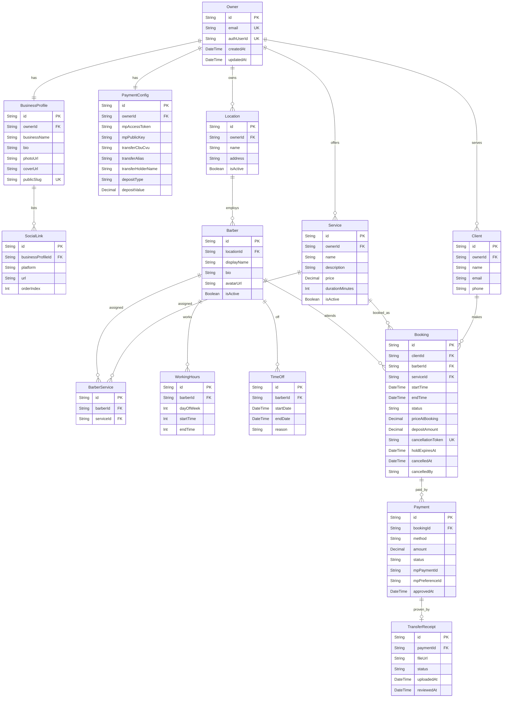

# Data Model Documentation
## Reserva Barber

> **Stack:** PostgreSQL (Supabase) + Prisma ORM. Field types below use Prisma/PostgreSQL
> conventions (`String`, `Int`, `DateTime`, `Decimal`, `Boolean`, plus native `enum`s).
> Files (profile/cover images, transfer receipts) are stored in **Supabase Storage**;
> the database persists only their URL/path.

---

## Document Purpose

This document describes the data model for the **Reserva Barber** application, including:
- Entity descriptions and field definitions
- Validation rules per entity
- Relationships between entities
- An entity-relationship (ER) diagram

**Identifier convention:** every entity uses a surrogate string primary key `id`
(`@id @default(cuid())`). This keeps public-facing identifiers (e.g., in URLs and the
cancellation link) non-sequential and non-guessable.

**Money convention:** all monetary values use `Decimal` (never floating point), in ARS.

---

## Model Descriptions

### 1. Owner
The single administrative user of the system — the business owner who manages every location, barber, service, and payment setting. There is no barber login and no multi-owner tenancy in this version. Authentication is handled by **Supabase Auth** (email/password, sign-ups disabled); the domain database never stores credentials.

**Fields:**
- `id`: Unique identifier (PK, cuid)
- `email`: Owner's login email (max 255, required, unique, stored lowercase) — a denormalized copy; Supabase Auth is the source of truth, refreshed by the provisioning script
- `authUserId`: Foreign key to the Supabase `auth.users.id` (unique, nullable until provisioned) — sessions resolve through this field, never through email
- `createdAt`: Account creation timestamp (auto-set)
- `updatedAt`: Last update timestamp (auto-updated)

**Validation Rules:**
- Email: required, unique system-wide, valid email format, normalized to lowercase
- Password: minimum 12 characters, enforced by Supabase Auth (Authentication → Policies). The domain database never stores it — this rule is configured in the provider, not in application code
- Exactly one `Owner` row may exist system-wide; only a database migration or the owner-provisioning script may create it — no application code path (page, server action, or seed) creates an `Owner`
- `authUserId` is set by the provisioning script (`scripts/provision-owner.ts`), never by application code
- `id` exception: the single Owner row is created by the A1 migration with the fixed literal `owner-root` rather than a generated cuid, so the migration can reference it deterministically when backfilling `Location.ownerId`. Every other entity follows the cuid convention above.

**Relationships:**
- `businessProfile`: One-to-one → BusinessProfile
- `paymentConfig`: One-to-one → PaymentConfig
- `locations`: One-to-many → Location
- `services`: One-to-many → Service

---

### 2. BusinessProfile
The public-facing profile shown to clients when they open the shared booking link. Belongs to the Owner (brand-level; the client picks a specific location inside the booking flow).

**Fields:**
- `id`: Unique identifier (PK, cuid)
- `ownerId`: Foreign key → Owner (required, unique — one profile per owner)
- `businessName`: Barbershop / brand name (max 120, required)
- `bio`: Public biography / description (max 1000, optional)
- `photoUrl`: URL of the profile photo in Supabase Storage (optional)
- `coverUrl`: URL of the cover image in Supabase Storage (optional)
- `publicSlug`: Unique slug used to build the public booking link (e.g., `/b/{publicSlug}`) (required, unique)
- `createdAt` / `updatedAt`: Timestamps

**Validation Rules:**
- `businessName`: required, 2–120 characters
- `publicSlug`: required, unique, URL-safe (lowercase, hyphens), 3–60 characters
- `photoUrl` / `coverUrl`: must point to an allowed image type (JPG, PNG, WEBP), max 5 MB, validated at upload

**Relationships:**
- `owner`: One-to-one → Owner
- `socialLinks`: One-to-many → SocialLink

---

### 3. SocialLink
A single social network / external link displayed on the public profile.

**Fields:**
- `id`: Unique identifier (PK, cuid)
- `businessProfileId`: Foreign key → BusinessProfile (required)
- `platform`: Social platform — enum `SocialPlatform` (`INSTAGRAM`, `FACEBOOK`, `TIKTOK`, `WHATSAPP`, `X`, `YOUTUBE`, `WEBSITE`) (required)
- `url`: Full URL to the profile/page (max 500, required)
- `orderIndex`: Display order on the profile (Int, required)

**Validation Rules:**
- `url`: required, valid URL format
- `platform` + `businessProfileId`: unique together (one link per platform per profile)

**Relationships:**
- `businessProfile`: Many-to-one → BusinessProfile

---

### 4. Location
A physical barbershop branch owned by the Owner. Each barber belongs to exactly one location.

**Fields:**
- `id`: Unique identifier (PK, cuid)
- `ownerId`: Foreign key → Owner (required)
- `name`: Location name (max 120, required)
- `address`: Street address (max 255, optional)
- `isActive`: Whether the location is active/bookable (Boolean, default: true)
- `createdAt` / `updatedAt`: Timestamps

**Validation Rules:**
- `name`: required, 2–120 characters after normalization, unique per owner
- **Name normalization (application layer):** before validation and persistence, `name` is trimmed, runs of internal whitespace are collapsed to a single space, and Unicode NFC normalization is applied. Without this, `Sucursal  Centro` (double space) and a decomposed-accent spelling of an existing name are byte-different and pixel-identical, and the uniqueness constraint would accept both.
- **Uniqueness is enforced by the database** via a composite unique constraint on `(ownerId, name)` — not by application checking alone. The application's case-insensitive pre-check exists only to produce a readable field error; it cannot be the guarantee, because the check and the write are separate round trips against a transaction-mode pooler. A constraint violation is translated into a domain error before it reaches the presentation layer.
- `address`: optional, max 255 characters; a blank submission is stored as `null`, never as an empty string

**Relationships:**
- `owner`: Many-to-one → Owner
- `barbers`: One-to-many → Barber

---

### 5. Barber
A barber who works at a single location and can be assigned to one or more services. Barbers are managed by the Owner; they are not system users.

**Fields:**
- `id`: Unique identifier (PK, cuid)
- `locationId`: Foreign key → Location (required)
- `displayName`: Barber's public name (max 120, required)
- `bio`: Short description (max 500, optional)
- `avatarUrl`: URL of the barber's photo in Supabase Storage (optional)
- `isActive`: Whether the barber is active/bookable (Boolean, default: true)
- `createdAt` / `updatedAt`: Timestamps

**Validation Rules:**
- `displayName`: required, 2–120 characters after normalization, unique per location
- **Name normalization (application layer):** `displayName` is normalized by the same shared rule as `Location.name` (see §4). The rule has one implementation; two entities constrained by uniqueness must not disagree about what "the same name" means.
- **Uniqueness is enforced by the database** via a composite unique constraint on `(locationId, displayName)`. It is scoped to the *location*, not the owner: the same person's name recurring across branches is legitimate, while two identically-named barbers at one branch cannot be told apart in the booking flow. As with `Location`, the application's case-insensitive pre-check exists only to produce a readable field error and cannot be the guarantee.
- `bio`: optional, max 500 characters; a blank submission is stored as `null`, never as an empty string
- **Ownership is derived, never stored.** A barber has no `ownerId`. It belongs to an owner solely through `location.ownerId`, and every read and write MUST carry the owner as a predicate over that relation. Denormalizing `ownerId` onto Barber is rejected: it duplicates a fact the foreign key already carries and can drift on reassignment, leaving a row whose two ownership answers disagree.
- A barber must belong to an existing, **active** location to be bookable. A barber sitting at a location that was deactivated *after* the assignment is a legal state, not a broken one — so the application permits a barber to **remain** at an inactive location while refusing to **move** one there. The "remain" exemption is decided from the barber's stored `locationId`, never from a value supplied by a submission.
- `avatarUrl` is written only by story P1 (Supabase Storage). The column exists before then so the avatar feature needs no second migration on a populated table.
- Deleting a location that still has barbers is refused (`onDelete: Restrict`).

**Relationships:**
- `location`: Many-to-one → Location
- `services`: Many-to-many → Service (through BarberService)
- `workingHours`: One-to-many → WorkingHours
- `timeOffs`: One-to-many → TimeOff
- `bookings`: One-to-many → Booking

---

### 6. Service
A bookable service offered by the business (e.g., haircut, beard trim), with a price and a duration. A service can be created without any barber, but it only becomes available in the booking flow once at least one barber is assigned to it.

**Fields:**
- `id`: Unique identifier (PK, cuid)
- `ownerId`: Foreign key → Owner (required)
- `name`: Service name (max 120, required)
- `description`: Description (max 500, optional)
- `price`: Full service price (Decimal, required, ≥ 0)
- `durationMinutes`: Duration used to generate booking slots (Int, required, > 0)
- `isActive`: Whether the service is active (Boolean, default: true)
- `createdAt` / `updatedAt`: Timestamps

**Validation Rules:**
- `name`: required, 2–120 characters after normalization
- **Name normalization (application layer):** `name` is normalized by the same shared rule as `Location.name` and `Barber.displayName` (see §4). The rule has one implementation; three entities constrained by uniqueness must not disagree about what "the same name" means.
- **`name` is unique per owner**, enforced by a composite unique constraint on `(ownerId, name)`. Uniqueness is scoped to the owner rather than to a location because a service is offered by the business as a whole and `Service` has no location relation. As with `Location` and `Barber`, the database constraint is the authoritative guarantee; the application's case-insensitive pre-check exists only to produce a readable field error and cannot be the guarantee, because the check and the write are separate round trips against a transaction-mode pooler.
- `description`: optional, trimmed, max 500 characters; a blank submission is stored as `null`, never as an empty string
- `price`: required, non-negative, at most **2 decimal places**, and not greater than the documented application maximum (`9,999,999.99`). Persisted as `Decimal(12, 2)` — the column is deliberately wider than the rule so that a numeric overflow, which PostgreSQL raises as an untyped error, is unreachable by construction rather than by handling.
- **Price parsing (application layer):** the accepted decimal separator is `.` **or** `,`, because the platform and an es-AR keyboard disagree about which is correct. A value carrying a thousands separator (`4.500`, `4,500`) is **rejected as ambiguous** rather than interpreted — a wrong guess is a thousandfold pricing error. More than two decimal places is rejected, never silently rounded.
- `durationMinutes`: required positive integer, a multiple of the slot granularity (`SLOT_GRANULARITY_MINUTES` = 5), between 5 and 480. The granularity constant lives in the domain layer because slot generation and booking sizing consume the same definition; a second definition of the grid would surface as appointments that cannot be booked rather than as a failing test.
- **Availability rule (application layer):** a service is exposed in the public booking flow only while it is itself **active**, has at least one assigned barber via BarberService (§7), and at least one of those barbers is **active** *and* works at an **active location** (§4). All four terms are load-bearing: a service that is inactive, unassigned, assigned exclusively to inactive barbers, or assigned exclusively to barbers at closed branches is not bookable. Checking only the assignment would report a deactivated service as bookable; omitting the location would report one as bookable that no client can reach, because the booking flow selects a location **first** and a closed branch is never offered.
- **Bookability is currently reported per service, though the honest unit is the (service, location) pair.** Since the client picks a branch before a service, a service with active barbers at one branch and none at another is bookable at the first and not the second. The dashboard reports a single global fact and therefore hides the second half. Deliberately deferred to the story that defines the public service/barber selection — recorded in `docs/tech-debt.md` T23.
- **Ownership is stored, not derived.** Unlike `Barber` (§5), `Service` carries a real `ownerId` column, so every read and write scopes on that column rather than through a relation join. The derived-ownership pattern answers a schema that lacks an owner column and must not be applied to one that has it.
- **Editing a price is not retroactive.** `Booking.priceAtBooking` (§11) is a deliberate historical snapshot; the live service price is never the source of truth for a past booking.

**Relationships:**
- `owner`: Many-to-one → Owner
- `barbers`: Many-to-many → Barber (through BarberService)
- `bookings`: One-to-many → Booking

---

### 7. BarberService
Join entity linking barbers to the services they can perform. Presence of a row is what makes a service bookable with a given barber — this table, not `Service`, is the gate to the public booking flow.

**Fields:**
- `id`: Unique identifier (PK, cuid)
- `barberId`: Foreign key → Barber (required)
- `serviceId`: Foreign key → Service (required)
- `createdAt`: Timestamp. There is deliberately no `updatedAt`: the row carries no mutable field, so an assignment is created or destroyed, never edited.

**Validation Rules:**
- `barberId` + `serviceId`: unique together, enforced by a composite unique constraint on `(barberId, serviceId)`. Unlike the name constraints of §4–§6, this one is **never surfaced to the owner as an error**: the write requests `skipDuplicates`, so a re-submitted assignment is absorbed rather than reported. A duplicate assignment is not a mistake anyone can be asked to correct — it is the same intent expressed twice.
- **The same-owner rule has no database backing and is an application invariant.** Both referenced rows must belong to the same owner, but `Barber` has no `ownerId` column (§5 — ownership is derived through `location`), so no composite foreign key, unique constraint or `CHECK` can express the comparison. It is enforced at write time in exactly one place, and that choke point *is* the guarantee. Two consequences are binding: no code path may write this table except through that service, and the invariant is proven by an executable cross-owner test rather than asserted in a comment — a bulk insert bypasses relation validation entirely, so the foreign keys prove only that both ids exist, never that they agree about the owner.
- **Assignment is a set operation against a rendered baseline, not a blind replace.** The editor submits two parallel multi-value fields: the ids it rendered, and the subset of those that were checked. Additions are `checked − stored`; removals are `(rendered − checked) ∩ stored`. Diffing against `stored` alone is rejected: the rendered list is a snapshot, so a stale tab would silently delete an assignment created after its own page load — and the loss is a service that quietly stops being bookable, not a field that has to be retyped. A conflict over an id both tabs rendered remains last-write-wins (`tech-debt.md` T8); a conflict over an id only one of them ever saw is now unreachable by construction.
- **An empty selection is valid and means "this barber performs nothing".** With checkboxes, an all-unchecked form omits the key entirely, so an empty list is indistinguishable from a missing field unless the rendered-baseline field is read as the proof that a submission occurred. It must never be treated as a validation failure.
- **A service may be *added* only while it is active, but an assignment already held over a service deactivated afterwards is a legal state, not a broken one.** The application therefore permits an inactive service to **remain** assigned while refusing to **add** one — the same shape as the barber/inactive-location exemption in §5, and decided from stored state rather than from the submission.
- **Cardinality:** assignments per barber are bounded by the per-owner service cap (`MAX_SERVICES_PER_OWNER` = 50, §6). The submitted list is deduplicated and rejected above that bound *before* any database read, so a crafted submission cannot turn one save into an unbounded query.
- **Deleting either side removes the assignment (`onDelete: Cascade`).** A join row has no meaning without both endpoints. This differs deliberately from `Barber → Location` (`Restrict`, §5): there the child carries data of its own that must not vanish silently, here the row *is* the relationship. The rule is inert today — the application has no hard-delete path, and M6 is deactivation — and exists so that whenever deletion does arrive it is already correct.

**Derived reads:**
- **Bookability of a service** is the conjunction of three facts, evaluated at read time and never cached in a column: the service is active, it has at least one BarberService row, and at least one of those barbers is active. Encoding only the middle term would report a deactivated service as bookable the moment M6 ships. A denormalized `Service.isBookable` flag is rejected — it would need invalidating on four distinct events (assign, unassign, barber deactivation, service deactivation) and is wrong the first time one is missed, whereas the count is a single indexed aggregate over a set bounded by the service cap.
- `@@index([serviceId])` exists for that read and for the booking flow's "which barbers perform X" query. The composite unique constraint only serves the `barberId`-leading direction.

**Relationships:**
- `barber`: Many-to-one → Barber
- `service`: Many-to-one → Service

---

### 8. WorkingHours
A recurring weekly working window for a barber, used to generate available slots.

**Fields:**
- `id`: Unique identifier (PK, cuid)
- `barberId`: Foreign key → Barber (required)
- `dayOfWeek`: Day of week (Int, 0 = Sunday … 6 = Saturday, required)
- `startMinute`: Start of the window, **minutes from midnight in business local time** (Int, required)
- `endMinute`: End of the window, same units (Int, required)
- `createdAt`: Timestamp. There is deliberately no `updatedAt` — the write replaces rows rather than editing them.

**Validation Rules:**
- `dayOfWeek`: an **integer** 0–6. A non-integer is rejected explicitly: `0.5` satisfies a naive range comparison and then matches no day, so the window it carries would be discarded while the save reported success.
- `endMinute` must be strictly greater than `startMinute`. A zero-length window is rejected — a window containing no time is not a working day, it is the absence of one.
- **A window must not cross midnight.** The owner confirmed no barber works past 23:00, so `endMinute ≤ 1439` and the wrap-around case is unrepresentable by construction rather than by handling.
- Both values must be multiples of `SLOT_GRANULARITY_MINUTES` (5) — the same constant service duration uses (§6). A window that does not tile the grid produces slot times no other part of the system expects.
- **A day with no window is a non-working day.** There is deliberately no "closed" flag: absence of a window *is* the absence. A flag would create two representations of one fact, which can then disagree.
- **Times are stored as wall clock and never converted at rest.** A recurring schedule is a statement about a clock face ("we open at nine"), not about an instant. Storing an offset would mean a change in civil time silently reinterprets what the owner said. Conversion to an instant happens only when comparing a schedule against a booking, and lives in exactly one module.
- **One window per day in the product, several permitted by the schema.** The unique constraint is `(barberId, dayOfWeek, startMinute)`, not `(barberId, dayOfWeek)`. The editor currently offers a single continuous window per day; the wider constraint keeps a split shift (9–13, 16–20 — the common local pattern) representable without a migration over live data. Narrowing it would trade a free index column today for a migration later.
  - **Known consequence:** with one window, a barber working a split shift must enter 9–20, and slot generation will offer appointments during the midday break. That is a real booking defect, it belongs to the availability story, and it is recorded in `tech-debt.md` rather than left to be discovered.
- No overlap rule is enforced today because one window per day cannot overlap anything. It returns with the second window.

**Relationships:**
- `barber`: Many-to-one → Barber

---

### 9. TimeOff
A date or date range in which a barber is unavailable (day off, vacation, holiday), overriding the recurring WorkingHours.

**Fields:**
- `id`: Unique identifier (PK, cuid)
- `barberId`: Foreign key → Barber (required)
- `startsAt`: First unavailable instant, **UTC in `@db.Timestamptz`** (required)
- `endsAt`: First available instant after the absence, same type (required)
- `reason`: Optional note (max 255, optional)
- `createdAt`: Timestamp. No `updatedAt` — an absence is recorded or removed, never edited; changing one is a remove plus an add.

**Validation Rules:**
- **The range is half-open: `[startsAt, endsAt)`.** The start is inside the absence, the end is not. This matches `Booking`'s `[startTime, endTime)` (§11) on purpose — if the two disagreed, a booking beginning exactly when an absence ends would be blocked or allowed depending on which rule the availability code evaluated first, and that surfaces as a mysterious unbookable slot rather than as a failing test.
- **Instants, not dates.** The fields were previously described as "date/datetime"; those are different types and only one has a defined instant. An absence is a point in time and obeys the stored-time convention in *General Conventions* — UTC in a zone-aware column, never the zone-less Prisma default.
- **A whole day is expressed in the same range, with no `isAllDay` flag.** A full day off is `[00:00 local, 00:00 next-day local)`. A flag would be a second way to state one fact, and two representations can disagree.
- **The form's "hasta" is inclusive for whole days and exclusive for a timed range.** With both times empty, "del 1 al 15" covers the 15th and therefore ends at the start of the 16th. With times given, the range ends at the instant named. Both readings are correct for their input; the conversion lives in exactly one function because an off-by-one here silently hands the barber back a day and nothing else in the system would notice.
- `endsAt` must be **strictly after** `startsAt`. A zero-length range blocks nothing and is a data-entry error wearing the shape of a record.
- **Bounded:** at most 365 days long, starting no more than 2 years ahead and no more than 1 year in the past. Without bounds a mistyped year is accepted and permanently disables a barber with no error anywhere. Past absences remain allowed because recording one after the fact is legitimate — which is also why the backward bound is tighter.
- **Overlaps between a barber's absences are allowed.** They union when availability is computed. Rejecting them would stop an owner who recorded a long holiday from recording a specific appointment inside it.
- **Identity is `(barberId, startsAt, endsAt)`**, enforced by a unique constraint, which is what makes a retried create idempotent. Two absences with identical boundaries are the same absence; a duplicate range carrying a different `reason` is not a second fact.
- **`reason` never leaves the dashboard.** It can hold medical information, so it must not reach any log entry or any read intended for a consumer other than the absences editor. Confinement is structural — a projection that omits the field — rather than a matter of remembering. A blank submission is stored as `null`, never as an empty string.
- Time-off ranges block slot generation for the affected barber.
- **Business-wide holidays are not modelled.** A national holiday needs one row per barber today; a `BusinessHoliday` entity is recorded as technical debt rather than assumed.

**Relationships:**
- `barber`: Many-to-one → Barber

---

### 10. Client
A guest customer who books an appointment. Clients do not have accounts; they are identified by their contact data and deduplicated by email per owner.

**Fields:**
- `id`: Unique identifier (PK, cuid)
- `ownerId`: Foreign key → Owner (required — clients belong to the business they booked with)
- `name`: Full name (max 120, required)
- `email`: Email address (max 255, required)
- `phone`: Phone number (max 30, required)
- `createdAt` / `updatedAt`: Timestamps

**Validation Rules:**
- `name`: required, 2–120 characters
- `email`: required, valid email format; unique per owner (`ownerId` + `email` unique together) to deduplicate returning clients
- `phone`: required, valid phone format (AR)

**Relationships:**
- `owner`: Many-to-one → Owner
- `bookings`: One-to-many → Booking

---

### 11. Booking
A single appointment. This is the central entity of the system: it ties a client, a barber, and a service to a time slot, and tracks the booking lifecycle and its deposit.

**Fields:**
- `id`: Unique identifier (PK, cuid)
- `clientId`: Foreign key → Client (required)
- `barberId`: Foreign key → Barber (required)
- `serviceId`: Foreign key → Service (required)
- `startTime`: Appointment start (DateTime, required)
- `endTime`: Appointment end — derived from `startTime` + `service.durationMinutes` (DateTime, required)
- `status`: Lifecycle state — enum `BookingStatus` (see below) (required, default: `PENDING_PAYMENT`)
- `priceAtBooking`: Service price snapshot at booking time (Decimal, required)
- `depositAmount`: Deposit required/charged to confirm (Decimal, required)
- `cancellationToken`: Unguessable token used in the client cancellation link (required, unique)
- `holdExpiresAt`: When the provisional hold expires if not confirmed (DateTime, optional)
- `cancelledAt`: When the booking was cancelled (DateTime, optional)
- `cancelledBy`: Who cancelled — enum `CancelledBy` (`OWNER`, `CLIENT`) (optional)
- `createdAt` / `updatedAt`: Timestamps

**`BookingStatus` enum values:**
- `PENDING_PAYMENT` — slot held provisionally while the client completes payment (Mercado Pago not yet confirmed, or transfer receipt not yet uploaded)
- `PENDING_APPROVAL` — transfer receipt uploaded, awaiting owner approval (still a provisional hold)
- `CONFIRMED` — payment confirmed (Mercado Pago webhook) or transfer approved by owner
- `CANCELLED` — cancelled by owner or client
- `EXPIRED` — provisional hold expired without confirmation; slot released

**Validation Rules:**
- `startTime` must be within the barber's WorkingHours and not inside any TimeOff range
- **No-overlap rule:** for a given barber, no two bookings in a *blocking* status (`PENDING_PAYMENT`, `PENDING_APPROVAL`, `CONFIRMED`) may overlap in `[startTime, endTime)`. This must be enforced transactionally (see `backend-standards.md`) to prevent double-booking under concurrency.
- The chosen service must be assigned to the chosen barber (a BarberService row must exist)
- `depositAmount` is derived from PaymentConfig (`FIXED` value or `PERCENT` of `priceAtBooking`)

**Relationships:**
- `client`: Many-to-one → Client
- `barber`: Many-to-one → Barber
- `service`: Many-to-one → Service
- `payments`: One-to-many → Payment

> **Note on location:** a booking's location is derived through its barber (`barber.locationId`); it is intentionally not duplicated on Booking to preserve normalization. Location-filtered statistics join through Barber.

---

### 12. Payment
A payment attempt/record associated with a booking's deposit. Supports both Mercado Pago and bank transfer.

**Fields:**
- `id`: Unique identifier (PK, cuid)
- `bookingId`: Foreign key → Booking (required)
- `method`: Payment method — enum `PaymentMethod` (`MERCADO_PAGO`, `BANK_TRANSFER`) (required)
- `amount`: Amount of the payment (Decimal, required — normally the deposit)
- `status`: Payment state — enum `PaymentStatus` (`PENDING`, `APPROVED`, `REJECTED`) (required, default: `PENDING`)
- `mpPaymentId`: External Mercado Pago payment id (optional, for MP method)
- `mpPreferenceId`: External Mercado Pago preference id (optional, for MP method)
- `approvedAt`: When the payment was approved (DateTime, optional)
- `createdAt` / `updatedAt`: Timestamps

**Validation Rules:**
- `amount`: required, > 0
- For `MERCADO_PAGO`: status transitions are driven by the MP webhook, keyed by `mpPaymentId`
- For `BANK_TRANSFER`: status transitions to `APPROVED`/`REJECTED` are driven by the owner reviewing the TransferReceipt

**Relationships:**
- `booking`: Many-to-one → Booking
- `transferReceipt`: One-to-one (optional) → TransferReceipt (only for bank transfers)

---

### 13. TransferReceipt
A proof-of-transfer file uploaded by the client for a bank-transfer payment, which the owner approves or rejects from the dashboard.

**Fields:**
- `id`: Unique identifier (PK, cuid)
- `paymentId`: Foreign key → Payment (required, unique — one receipt per transfer payment)
- `fileUrl`: URL of the uploaded receipt in Supabase Storage (required)
- `status`: Review state — enum `ReceiptStatus` (`PENDING`, `APPROVED`, `REJECTED`) (required, default: `PENDING`)
- `uploadedAt`: When the client uploaded the receipt (auto-set)
- `reviewedAt`: When the owner reviewed it (DateTime, optional)

**Validation Rules:**
- `fileUrl`: required; allowed types JPG, PNG, PDF; max 10 MB (validated at upload)
- Approving a receipt sets the parent Payment to `APPROVED` and the Booking to `CONFIRMED`
- Rejecting a receipt sets the parent Payment to `REJECTED` and releases the Booking hold (Booking → `CANCELLED` or `EXPIRED`)

**Relationships:**
- `payment`: One-to-one → Payment

---

### 14. PaymentConfig
The owner's shared payment configuration, applied across all locations: Mercado Pago credentials, bank-transfer destination, and deposit policy.

**Fields:**
- `id`: Unique identifier (PK, cuid)
- `ownerId`: Foreign key → Owner (required, unique — one config per owner)
- `mpAccessToken`: Mercado Pago Access Token (encrypted at rest, optional until configured)
- `mpPublicKey`: Mercado Pago Public Key (optional until configured)
- `transferCbuCvu`: Bank transfer CBU/CVU (max 30, optional)
- `transferAlias`: Bank transfer alias (max 60, optional)
- `transferHolderName`: Account holder name shown to clients (max 120, optional)
- `depositType`: How the deposit is computed — enum `DepositType` (`FIXED`, `PERCENT`) (required, default: `PERCENT`)
- `depositValue`: Fixed amount (ARS) or percentage (0–100) depending on `depositType` (Decimal, required)
- `createdAt` / `updatedAt`: Timestamps

**Validation Rules:**
- `mpAccessToken` must never be exposed to the client/browser; only `mpPublicKey` is safe to send to the frontend
- At least one payment method must be fully configured before the public booking flow can accept bookings (MP credentials present, and/or transfer CBU/CVU/alias present)
- `depositValue`: required; if `PERCENT`, must be between 1 and 100; if `FIXED`, must be > 0

**Relationships:**
- `owner`: One-to-one → Owner

---

## Entity Relationship Diagram

---

## Key Design Principles

1. **Referential Integrity** — All foreign key relationships are explicitly declared and enforced at the database level. Deletes use `RESTRICT` on entities with historical value (e.g., a Client with Bookings) and `CASCADE` only where a child cannot exist without its parent (e.g., SocialLink without BusinessProfile).

2. **Flexibility** — Availability is modeled as configurable data (WorkingHours + TimeOff + Service duration), not hardcoded logic. Slots are computed on demand, so schedule changes require no schema changes.

3. **Audit Trail** — Timestamp fields (`createdAt`, `updatedAt`, `uploadedAt`, `reviewedAt`, `approvedAt`, `cancelledAt`) provide a queryable timeline for bookings, payments, and receipt reviews — feeding the dashboard statistics.

4. **Extensibility** — The modular entity design allows new features (e.g., promotions, multi-service bookings, barber accounts) to be added without breaking existing relationships.

5. **Data Normalization** — The schema follows normalization (≥ 3NF): a booking's location and price-derived data are not duplicated but derived/snapshotted intentionally. `priceAtBooking` and `depositAmount` are deliberate snapshots (historical accuracy for income statistics), not denormalization of live values.

---

## General Conventions

- **Primary keys**: All entities use a string surrogate key `id` with `@default(cuid())` (Prisma) for non-guessable identifiers.
- **Foreign keys**: Declared explicitly with referential-integrity constraints; `onDelete` behavior chosen per relationship (RESTRICT vs CASCADE) as described above.
- **Unique constraints**: Applied to `Owner.email`, `BusinessProfile.publicSlug`, `Booking.cancellationToken`, `PaymentConfig.ownerId`, and composite uniques (`Location(ownerId, name)`, `Barber(locationId, displayName)`, `Service(ownerId, name)`, `Client(ownerId, email)`, `BarberService(barberId, serviceId)`, `SocialLink(businessProfileId, platform)`).
- **Optional fields**: Represented as nullable; required fields are non-nullable.
- **Enum / status fields**: Defined as native PostgreSQL enums via Prisma (`BookingStatus`, `PaymentMethod`, `PaymentStatus`, `ReceiptStatus`, `DepositType`, `SocialPlatform`, `CancelledBy`) and validated at the application layer.
- **Timestamps**: `createdAt` via `@default(now())`; `updatedAt` via `@updatedAt`.
- **Stored time — two kinds, never mixed.** The distinction is recorded here rather than left to be inferred from column types:
  - A **recurring schedule** (`WorkingHours`, §8) is stored as **wall-clock minutes from midnight in business local time**, with no offset applied at rest.
  - A **point in time** (`TimeOff` §9, `Booking.startTime`/`endTime`/`holdExpiresAt` §11, and every `createdAt`/`updatedAt`) is a **UTC instant** and must use a zone-aware column, `@db.Timestamptz`.

  Prisma's default for `DateTime` is a zone-**less** `TIMESTAMP`, which is harmless for `createdAt` and wrong for anything compared against a human's clock. `Booking.startTime` must therefore declare `@db.Timestamptz` explicitly when it is created; inheriting the default by omission is the failure mode this convention exists to prevent.
- **Business timezone**: `America/Argentina/Buenos_Aires`, a constant rather than a column — every branch is in Argentina. Conversion between local time and instants lives in exactly one domain module. The deployment runtime is UTC, so `getDay()`, `getHours()`, `getDate()` and `toISOString().slice(0, 10)` are **forbidden in scheduling code**: they return the UTC answer, which is wrong for the last three hours of every local day, and they return a plausible number rather than raising. Timezone data support on the runtime is proven by an executable check, because a runtime lacking it falls back to UTC silently.
- **Money**: All amounts use `Decimal` (Prisma `@db.Decimal`) to avoid floating-point rounding errors; currency is ARS.
- **Secrets**: `PaymentConfig.mpAccessToken` is encrypted at rest and never sent to the browser; only `mpPublicKey` is exposed to the frontend.
- **Concurrency**: The Booking no-overlap invariant is enforced inside a database transaction (see `backend-standards.md`), never by application-level read-then-write alone.
